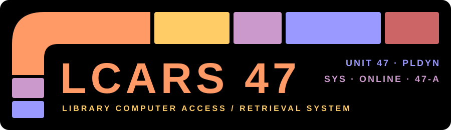

**The official Planetary Dynamics Discord Bot**

Developed and Maintained by: SkyeRangerDelta

Developed for use in the Planetary Dynamics (PlDyn) Discord server by PlDyn members for their use.

---

> `LCARS47 ONLINE.` Library Computer Access/Retrieval System standing by.

**LCARS47** is the resident ship's computer for the Planetary Dynamics Discord — purpose built Star Trek themed Omnissiah worshipping 
computer for PlDyn.

---

A full voice-channel music system. It streams from a private Jellyfin library first and the
open web second, handling search, queueing, whole albums and playlists, an interactive song
selector, now-playing readouts with cover art, and on-demand lyrics.

An in-character ship's computer powered by Claude. It converses through several distinct
personas, reasons over attached images and documents, can think harder when asked, and reaches
into the bot's own systems so its answers reflect what's actually happening aboard.

Real-time health and status for the crew's infrastructure — load, memory, storage, and uptime
across monitored hosts — alongside the bot's own vitals and a properly computed stardate.

Imagery pulled straight from the James Webb Space Telescope archive — nebulae, galaxy
clusters, and exoplanet observations on request.

Self-serve role management plus a Ferengi Dabo wheel for wagering Gold-Pressed Latinum —
balances, streaks, and leaderboards included.

A LAN-only HTTP API for telemetry and outbound messaging, with a Swagger UI explorer at
`/api/docs` and an OpenAPI 3.1 document at `/api/openapi.json` — both assembled from the
routes themselves at boot. See [the technical notes](docs/technical/api-swagger.md).

---

**Source-available.** Read it, study it, reference it, and open issues or pull requests —
you're welcome to. LCARS47 is built specifically for the Planetary Dynamics server and isn't
packaged for general use; if you work out what it takes to self-host, you're free to try, but
no setup help or support will be provided. © SkyeRangerDelta.
