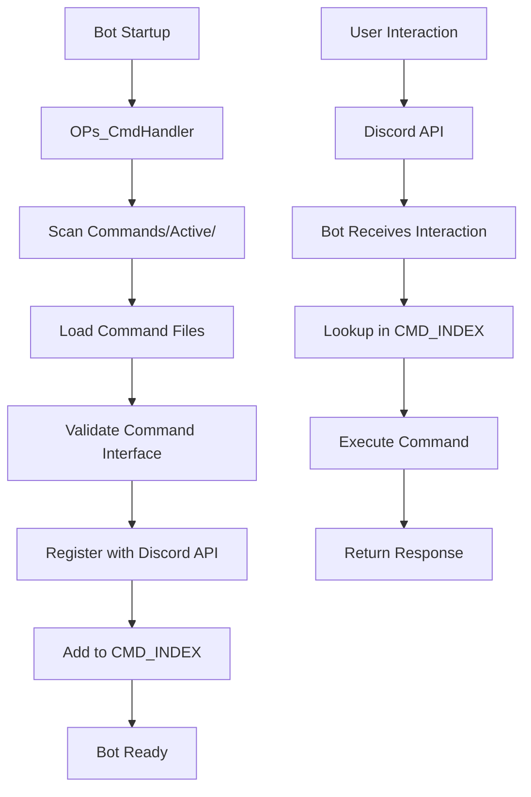
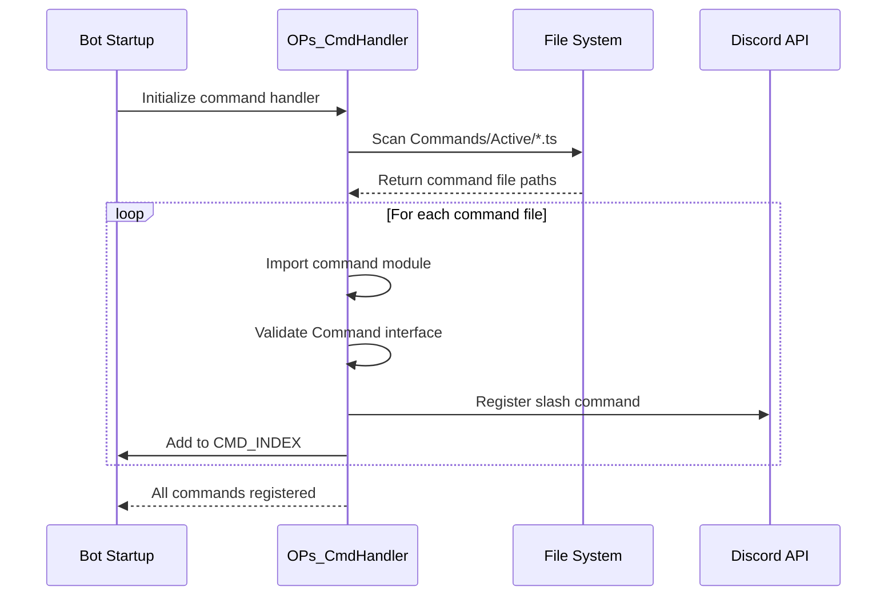

# LCARS47 Command Architecture Reference

**Repository:** [LCARS47](https://github.com/SkyeRangerDelta/LCARS47)
**Bot Version:** v6.0.0-Experimental.2
**Framework:** Discord.js v14
**Language:** TypeScript

---

## Table of Contents

1. [Command Structure Overview](#command-structure-overview)
2. [Command Interface Requirements](#command-interface-requirements)
3. [File Location and Naming](#file-location-and-naming)
4. [Auto-Registration System](#auto-registration-system)
5. [LCARSClient Extensions](#lcarsclient-extensions)
6. [Best Practices](#best-practices)
7. [Integration Points](#integration-points)
8. [Discord.js v14 Patterns](#discordjs-v14-patterns)
9. [Example Command Walkthrough](#example-command-walkthrough)

---

## Command Structure Overview

LCARS47 uses a modular command architecture where each command is a self-contained TypeScript module that exports a standardized structure. Commands are automatically discovered and registered at bot startup.

### Core Principles

1. **Self-Contained:** Each command is an independent file with all logic
2. **Type-Safe:** Uses TypeScript interfaces for compile-time validation
3. **Auto-Discovered:** No manual registration required
4. **Standardized:** All commands follow the same interface pattern
5. **Extensible:** Easy to add new commands without modifying core code

### Architecture Diagram



---

## Command Interface Requirements

All commands must implement the `Command` interface defined in `C:\GitHub Repos\LCARS47\Src\Subsystems\Auxiliary\Interfaces\CommandInterface.ts`:

### Interface Definition

```typescript
import { type LCARSClient } from '../LCARSClient';
import { type ChatInputCommandInteraction } from 'discord.js';
import { type SlashCommandBuilder } from '@discordjs/builders';

export interface Command {
  name: string
  data: SlashCommandBuilder
  ownerOnly?: boolean
  execute: (LCARSClient: LCARSClient, interaction: ChatInputCommandInteraction) => unknown
  help: () => string
}
```

### Required Properties

#### 1. `name: string`

**Purpose:** Unique identifier for the command

**Requirements:**
- Must match the command name in `data`
- Lowercase, no spaces
- Typically matches filename (without .ts extension)

**Example:**
```typescript
name: 'server-status'
```

---

#### 2. `data: SlashCommandBuilder`

**Purpose:** Discord slash command definition using builders API

**Requirements:**
- Must use `SlashCommandBuilder` from `@discordjs/builders`
- Define command name, description, and options
- Configure autocomplete, choices, permissions

**Example:**
```typescript
import { SlashCommandBuilder } from '@discordjs/builders';

const data = new SlashCommandBuilder()
  .setName('server-status')
  .setDescription('Retrieves system metrics from servers')
  .addStringOption(option =>
    option
      .setName('system')
      .setDescription('Server to query')
      .setRequired(true)
      .setAutocomplete(true)
  );
```

**Common Options:**
- `.addStringOption()` - Text input
- `.addIntegerOption()` - Number input
- `.addBooleanOption()` - True/false toggle
- `.addUserOption()` - Discord user selector
- `.addChannelOption()` - Channel selector
- `.addRoleOption()` - Role selector
- `.addSubcommand()` - Nested commands

---

#### 3. `execute: (LCARSClient, ChatInputCommandInteraction) => unknown`

**Purpose:** Main command logic executed when command is invoked

**Signature:**
```typescript
async function execute(
  LCARS47: LCARSClient,
  int: ChatInputCommandInteraction
): Promise<void> {
  // Command implementation
}
```

**Parameters:**
- `LCARS47: LCARSClient` - Extended Discord.js client with LCARS47 properties
- `int: ChatInputCommandInteraction` - Discord interaction object

**Return:**
- Can return `void`, `Promise<void>`, or any value
- Typically async and returns `Promise<void>`

**Example:**
```typescript
async function execute(LCARS47: LCARSClient, int: ChatInputCommandInteraction): Promise<void> {
  Utility.log('info', '[Command] Executing command...');

  // Defer reply for long operations
  await int.deferReply();

  try {
    // Command logic here
    const result = await someAsyncOperation();

    await int.editReply({
      content: `Result: ${result}`
    });
  } catch (error) {
    Utility.log('err', `[Command] Error: ${error}`);
    await int.editReply({
      content: 'An error occurred while processing your request.'
    });
  }
}
```

---

#### 4. `help: () => string`

**Purpose:** Returns user-friendly help text for the command

**Signature:**
```typescript
function help(): string {
  return 'Description of what this command does';
}
```

**Example:**
```typescript
function help(): string {
  return 'Retrieves real-time system metrics from monitored servers via Beszel.';
}
```

**Usage:**
- Displayed in help commands
- Used for documentation generation
- Should be concise (1-2 sentences)

---

### Optional Properties

#### `ownerOnly?: boolean`

**Purpose:** Restricts command to bot owner only

**Default:** `false`

**Example:**
```typescript
export default {
  name: 'shutdown',
  data,
  execute,
  help,
  ownerOnly: true  // Only bot owner can use
} satisfies Command;
```

**Implementation:**
- Check performed in command handler
- Compares user ID to owner ID from config
- Returns error if unauthorized

---

#### `autocomplete?: (LCARSClient, AutocompleteInteraction) => unknown`

**Purpose:** Handles autocomplete interactions for dynamic option values

**Signature:**
```typescript
async function autocomplete(
  LCARS47: LCARSClient,
  int: AutocompleteInteraction
): Promise<void> {
  const choices = [
    { name: 'Option 1', value: 'opt1' },
    { name: 'Option 2', value: 'opt2' }
  ];

  await int.respond(choices);
}
```

**Example (Dynamic):**
```typescript
async function autocomplete(LCARS47: LCARSClient, int: any): Promise<void> {
  try {
    // Fetch dynamic options from API
    const systems = await getSystems(LCARS47.BESZEL_CLIENT);

    const choices = systems.items.map(sys => ({
      name: `${sys.name} (${sys.status})`,
      value: sys.id
    }));

    await int.respond(choices);
  } catch (error) {
    Utility.log('err', `[Autocomplete] Error: ${error}`);
    await int.respond([]);
  }
}
```

**Requirements:**
- Must respond within 3 seconds
- Max 25 choices
- Choices have `name` (displayed) and `value` (passed to command)

---

## File Location and Naming

### Directory Structure

```
C:\GitHub Repos\LCARS47\
└── Src\
    └── Commands\
        ├── Active\           # Active commands (auto-registered)
        │   ├── play.ts
        │   ├── status.ts
        │   ├── jwst.ts
        │   └── server-status.ts
        └── Inactive\         # Disabled commands (not loaded)
            └── deprecated.ts
```

### Naming Conventions

**Filename:**
- Use kebab-case: `server-status.ts`, `play.ts`
- Match command name (for clarity)
- Use `.ts` extension (TypeScript)

**Command Name:**
- Lowercase, no spaces
- Use hyphens for multi-word commands
- Max 32 characters (Discord limit)

**Examples:**
- File: `server-status.ts` → Command: `server-status`
- File: `play.ts` → Command: `play`
- File: `role.ts` → Command: `role`

---

## Auto-Registration System

### How It Works

LCARS47 automatically discovers and registers commands at startup using the `OPs_CmdHandler` system.

### Registration Flow



### Handler Implementation (Conceptual)

```typescript
// Simplified version of OPs_CmdHandler.ts
import * as fs from 'fs';
import * as path from 'path';
import { REST } from '@discordjs/rest';
import { Routes } from 'discord-api-types/v10';

async function registerCommands(LCARS47: LCARSClient) {
  const commands = [];
  const commandsPath = path.join(__dirname, '..', 'Commands', 'Active');
  const commandFiles = fs.readdirSync(commandsPath).filter(f => f.endsWith('.ts') || f.endsWith('.js'));

  // Load commands
  for (const file of commandFiles) {
    const filePath = path.join(commandsPath, file);
    const command = await import(filePath);

    // Validate command structure
    if ('data' in command.default && 'execute' in command.default) {
      commands.push(command.default.data.toJSON());
      LCARS47.CMD_INDEX.set(command.default.name, command.default);
    } else {
      console.warn(`[CmdHandler] ${file} is missing required properties`);
    }
  }

  // Register with Discord
  const rest = new REST({ version: '10' }).setToken(process.env.TOKEN);

  await rest.put(
    Routes.applicationCommands(clientId),
    { body: commands }
  );

  console.log(`[CmdHandler] Registered ${commands.length} commands`);
}
```

### Key Points

1. **Automatic Discovery:** No need to manually list commands
2. **Validation:** Invalid commands are skipped with warnings
3. **Centralized Registry:** All commands stored in `CMD_INDEX` Collection
4. **Discord Sync:** Commands registered with Discord API on startup

---

## LCARSClient Extensions

The `LCARSClient` interface extends Discord.js's `Client` class with LCARS47-specific properties accessible throughout the bot lifecycle.

### Interface Definition

**File:** `C:\GitHub Repos\LCARS47\Src\Subsystems\Auxiliary\LCARSClient.ts`

```typescript
import {
  type Client,
  type Collection,
  type Guild,
  type GuildMember
} from 'discord.js';
import { type LCARSMediaPlayer } from './Interfaces/MediaInterfaces.js';
import { type MongoClient } from 'mongodb';
import { type StatusInterface } from './Interfaces/StatusInterface.js';
import { type BeszelClient } from './Interfaces/BeszelInterfaces.js';
import type { Command } from './Interfaces/CommandInterface';

export interface LCARSClient extends Client {
  CMD_INDEX: Collection<string, Command>
  PLDYN: Guild
  MEMBER: GuildMember
  MEDIA_QUEUE: Map<string, LCARSMediaPlayer>
  RDS_CONNECTION: MongoClient
  BESZEL_CLIENT: BeszelClient
  CLIENT_STATS: StatusInterface
}
```

### Existing Properties

#### `CMD_INDEX: Collection<string, Command>`

**Purpose:** Registry of all loaded commands

**Usage:**
```typescript
// Get command by name
const command = LCARS47.CMD_INDEX.get('server-status');

// Execute command
if (command) {
  await command.execute(LCARS47, interaction);
}

// List all commands
console.log(`Loaded ${LCARS47.CMD_INDEX.size} commands`);
```

---

#### `PLDYN: Guild`

**Purpose:** Reference to the primary Discord guild (server)

**Usage:**
```typescript
// Get guild name
console.log(`Guild: ${LCARS47.PLDYN.name}`);

// Fetch channel
const channel = await LCARS47.PLDYN.channels.fetch(channelId);

// Get member count
console.log(`Members: ${LCARS47.PLDYN.memberCount}`);
```

**Initialization:** Set in `ready.ts` event

---

#### `MEMBER: GuildMember`

**Purpose:** Reference to the bot's guild member object

**Usage:**
```typescript
// Get bot's display name
console.log(`Bot name: ${LCARS47.MEMBER.displayName}`);

// Check bot's permissions
const hasAdmin = LCARS47.MEMBER.permissions.has('Administrator');

// Get bot's roles
const roles = LCARS47.MEMBER.roles.cache;
```

---

#### `MEDIA_QUEUE: Map<string, LCARSMediaPlayer>`

**Purpose:** Media player instances per guild

**Usage:**
```typescript
// Get player for guild
const player = LCARS47.MEDIA_QUEUE.get(guildId);

// Create new player
LCARS47.MEDIA_QUEUE.set(guildId, newPlayer);

// Remove player
LCARS47.MEDIA_QUEUE.delete(guildId);
```

**Structure:**
- Key: Guild ID (string)
- Value: `LCARSMediaPlayer` object

---

#### `RDS_CONNECTION: MongoClient`

**Purpose:** MongoDB connection for persistent data storage

**Usage:**
```typescript
// Access database
const db = LCARS47.RDS_CONNECTION.db('LCARS47_DS');

// Query collection
const collection = db.collection('rds_status');
const data = await collection.findOne({ id: 1 });

// Update document
await collection.updateOne(
  { id: 1 },
  { $set: { STATE: true } }
);
```

**Initialization:** Set in `ready.ts` via `RDS.rds_connect()`

---

#### `BESZEL_CLIENT: PocketBase`

**Purpose:** PocketBase client for Beszel API access with authentication

**Usage:**
```typescript
// Make authenticated API request
const systems = await Beszel.getSystems(LCARS47.BESZEL_CLIENT);

// Check token expiry
if (LCARS47.BESZEL_CLIENT.tokenExpiry < Date.now()) {
  LCARS47.BESZEL_CLIENT = await Beszel.beszel_connect();
}

// Get base URL
const url = LCARS47.BESZEL_CLIENT.baseUrl;
```

**Initialization:** Set in `ready.ts` via `Beszel.beszel_connect()`

---

#### `CLIENT_STATS: StatusInterface`

**Purpose:** Bot runtime statistics and metrics

**Usage:**
```typescript
// Get uptime
const uptime = Date.now() - LCARS47.CLIENT_STATS.STARTUP_UTC;

// Track command usage
LCARS47.CLIENT_STATS.CMD_QUERIES++;

// Get version
console.log(`Bot version: ${LCARS47.CLIENT_STATS.VERSION}`);
```

**Structure:**
```typescript
interface StatusInterface {
  CLIENT_MEM_USAGE: number;
  CMD_QUERIES: number;
  CMD_QUERIES_FAILED: number;
  SYSTEM_LATENCY: number;
  MEDIA_PLAYER_DATA: object;
  MEDIA_PLAYER_STATE: boolean;
  QUERIES: number;
  SESSION: number;
  SESSION_UPTIME: number;
  STARTUP_TIME: string;
  STARTUP_UTC: number;
  VERSION: string;
  STATE: boolean;
}
```

---

### Adding Service Clients Pattern

When integrating new external services (APIs, databases, etc.), follow this pattern:

#### 1. Create Interface

```typescript
// In Src/Subsystems/Auxiliary/Interfaces/ServiceInterfaces.ts
export interface ServiceClient {
  baseUrl: string;
  authToken?: string;
  config: ServiceConfig;
}
```

#### 2. Extend LCARSClient

```typescript
// In LCARSClient.ts
import { type ServiceClient } from './Interfaces/ServiceInterfaces.js';

export interface LCARSClient extends Client {
  // ... existing properties
  SERVICE_CLIENT: ServiceClient  // ADD THIS
}
```

#### 3. Create Connection Module

```typescript
// In Src/Subsystems/ServiceName/Service_Connect.ts
async function service_connect(): Promise<ServiceClient> {
  // Authentication logic
  return {
    baseUrl: process.env.SERVICE_URL,
    authToken: token,
    config: {}
  };
}

export default { service_connect };
```

#### 4. Initialize in ready.ts

```typescript
// In Events/ready.ts
import Service from '../Subsystems/ServiceName/Service_Connect.js';

module.exports = {
  execute: async (LCARS47: LCARSClient) => {
    // ... existing initialization

    // Initialize service
    LCARS47.SERVICE_CLIENT = await Service.service_connect();
    Utility.log('info', '[CLIENT] Service integration initialized');
  }
};
```

#### 5. Access Throughout Bot

```typescript
// In any command or module
async function execute(LCARS47: LCARSClient, int: ChatInputCommandInteraction) {
  // Access service client
  const data = await fetchData(LCARS47.SERVICE_CLIENT);
}
```

---

## Best Practices

### 1. Type Safety with `satisfies`

Always use `satisfies Command` for type checking:

```typescript
// ✅ GOOD - Type-safe
export default {
  name: 'example',
  data,
  execute,
  help
} satisfies Command;

// ❌ BAD - No type checking
export default {
  name: 'example',
  data,
  execute,
  help
};
```

**Benefits:**
- Compile-time validation
- IntelliSense support
- Catch missing properties early

---

### 2. Deferred Replies for Long Operations

Use `deferReply()` for operations taking >3 seconds:

```typescript
async function execute(LCARS47: LCARSClient, int: ChatInputCommandInteraction): Promise<void> {
  // Defer immediately for long operations
  await int.deferReply();

  // Long operation (API call, database query, etc.)
  const result = await longOperation();

  // Edit deferred reply
  await int.editReply({
    content: `Result: ${result}`
  });
}
```

**Why:**
- Discord requires response within 3 seconds
- Prevents "Interaction failed" errors
- Shows "thinking" indicator to user

---

### 3. Comprehensive Error Handling

Always wrap command logic in try/catch:

```typescript
async function execute(LCARS47: LCARSClient, int: ChatInputCommandInteraction): Promise<void> {
  await int.deferReply();

  try {
    // Command logic
    const result = await riskyOperation();

    await int.editReply({ content: result });

  } catch (error) {
    // Log error with context
    Utility.log('err', `[CommandName] Error: ${error}`);

    // User-friendly error message
    await int.editReply({
      content: 'An error occurred while processing your request. Please try again later.'
    });
  }
}
```

**Best Practices:**
- Log errors with command name prefix
- Never expose internal errors to users
- Provide actionable feedback when possible

---

### 4. Logging with Utility.log()

Use standardized logging throughout commands:

```typescript
import Utility from '../../Subsystems/Utilities/SysUtils.js';

// Log levels
Utility.log('info', '[Command] Informational message');
Utility.log('warn', '[Command] Warning message');
Utility.log('err', '[Command] Error message');
Utility.log('proc', '[Command] Process/lifecycle message');
```

**Format:**
- Prefix with command/module name in brackets
- Use appropriate log level
- Include relevant context

---

### 5. Environment Variables for Credentials

Never hardcode credentials:

```typescript
// ✅ GOOD
const apiKey = process.env.API_KEY;
const dbUrl = process.env.DATABASE_URL;

// ❌ BAD
const apiKey = 'abc123xyz';
const dbUrl = 'mongodb://localhost:27017';
```

**Validation:**
```typescript
if (!process.env.API_KEY) {
  throw new Error('API_KEY environment variable is required');
}
```

---

## Integration Points

### Events

Commands interact with Discord events:

**ready.ts:**
- Initialize service clients
- Set up global state
- Register commands

**interactionCreate.ts:**
- Handle command interactions
- Route autocomplete requests
- Validate permissions

---

### Utilities

**SysUtils.ts:**
- `Utility.log()` - Logging
- `Utility.stardate()` - Timestamp formatting
- `Utility.flexTime()` - Time utilities
- `Utility.formatMSDiff()` - Duration formatting

**Example:**
```typescript
import Utility from '../../Subsystems/Utilities/SysUtils.js';

Utility.log('info', `[Command] Executed at ${Utility.flexTime()}`);
```

---

### Subsystems

**RemoteDS (MongoDB):**
```typescript
import RDS from '../../Subsystems/RemoteDS/RDS_Utilities.js';

// Fetch data
const data = await RDS.rds_selectOne(LCARS47.RDS_CONNECTION, 'collection', 1);

// Update data
await RDS.rds_update(LCARS47.RDS_CONNECTION, 'collection', { id: 1 }, { $set: { value: 'new' } });
```

**Beszel (Server Monitoring):**
```typescript
import Beszel from '../../Subsystems/Beszel/Beszel_Connect.js';

// Get systems
const systems = await Beszel.getSystems(LCARS47.BESZEL_CLIENT);

// Get metrics
const metrics = await Beszel.getSystemMetrics(LCARS47.BESZEL_CLIENT, systemId);
```

---

## Discord.js v14 Patterns

### Interaction Types

```typescript
import {
  ChatInputCommandInteraction,
  AutocompleteInteraction,
  ButtonInteraction,
  SelectMenuInteraction
} from 'discord.js';

// Slash command
async function execute(LCARS47: LCARSClient, int: ChatInputCommandInteraction) { }

// Autocomplete
async function autocomplete(LCARS47: LCARSClient, int: AutocompleteInteraction) { }

// Button click
async function handleButton(int: ButtonInteraction) { }

// Select menu
async function handleSelect(int: SelectMenuInteraction) { }
```

---

### Embeds

```typescript
import { EmbedBuilder } from 'discord.js';

const embed = new EmbedBuilder()
  .setTitle('Title')
  .setDescription('Description text')
  .setColor(0x00FF00)  // Green
  .setTimestamp()
  .addFields(
    { name: 'Field 1', value: 'Value 1', inline: true },
    { name: 'Field 2', value: 'Value 2', inline: true }
  )
  .setFooter({ text: 'Footer text' })
  .setThumbnail('https://example.com/image.png');

await int.editReply({ embeds: [embed] });
```

---

### Options

```typescript
// String option
const system = int.options.getString('system', true);  // required

// Integer option
const count = int.options.getInteger('count', false);  // optional

// Boolean option
const flag = int.options.getBoolean('flag') ?? false;  // default false

// User option
const user = int.options.getUser('target', true);

// Channel option
const channel = int.options.getChannel('channel', true);
```

---

### Autocomplete

```typescript
async function autocomplete(LCARS47: LCARSClient, int: AutocompleteInteraction): Promise<void> {
  // Get focused option
  const focusedOption = int.options.getFocused(true);

  // Filter choices based on user input
  const choices = allChoices.filter(choice =>
    choice.name.toLowerCase().includes(focusedOption.value.toLowerCase())
  );

  // Return up to 25 choices
  await int.respond(choices.slice(0, 25));
}
```

---

### Permissions

```typescript
import { PermissionFlagsBits } from 'discord.js';

// In command data
const data = new SlashCommandBuilder()
  .setName('admin-command')
  .setDescription('Admin only command')
  .setDefaultMemberPermissions(PermissionFlagsBits.Administrator);

// In execute function
if (!int.memberPermissions.has(PermissionFlagsBits.ManageMessages)) {
  return await int.reply({
    content: 'You need Manage Messages permission to use this command.',
    ephemeral: true
  });
}
```

---

## Example Command Walkthrough

### Complete Example: JWST Command

**File:** `C:\GitHub Repos\LCARS47\Src\Commands\Active\jwst.ts`

```typescript
// -- JWST COMMAND --

// Imports
import { type ChatInputCommandInteraction } from 'discord.js';
import { SlashCommandBuilder } from '@discordjs/builders';
import { type LCARSClient } from '../../Subsystems/Auxiliary/LCARSClient.js';
import https from 'https';
import Utility from '../../Subsystems/Utilities/SysUtils.js';
import { type Command } from '../../Subsystems/Auxiliary/Interfaces/CommandInterface';

// Command definition with subcommands
const data = new SlashCommandBuilder()
  .setName('jwst')
  .setDescription('Accesses the James Webb Space Telescope API.')
  .addSubcommand(s => s
    .setName('status')
    .setDescription('Retrieves version/status data about the JWST API.')
  )
  .addSubcommand(s => s
    .setName('random')
    .setDescription('Pulls a random image from MAST.')
    .addIntegerOption(o => o
      .setName('program-id')
      .setDescription('The ID of the JWST program to pull from.')
      .addChoices(
        { name: 'NGC 3324 (Carina)', value: 2731 },
        { name: "Stephan's Quintet", value: 2732 }
      )
      .setRequired(true)
    )
  );

// Execute function with subcommand routing
async function execute(LCARS47: LCARSClient, int: ChatInputCommandInteraction): Promise<void> {
  Utility.log('info', '[JWST] Received command');
  await int.deferReply();

  const subcommand = int.options.getSubcommand();
  Utility.log('info', `[JWST] Processing ${subcommand}`);

  switch (subcommand) {
    case 'status':
      doJWSTRequest('/', int);
      break;
    case 'random':
      const programId = int.options.getInteger('program-id', true);
      doJWSTRequest(`/program/id/${programId}`, int);
      break;
  }
}

// Helper function for HTTPS requests
function doJWSTRequest(path: string, int: ChatInputCommandInteraction): void {
  const options = {
    method: 'GET',
    hostname: 'api.jwstapi.com',
    path: path,
    headers: {
      'X-API-KEY': process.env.JWST
    }
  };

  const chunks: Buffer[] = [];

  const req = https.request(options, (res) => {
    Utility.log('info', '[JWST] Sending request');

    res.on('data', (chunk: Buffer) => {
      chunks.push(chunk);
    });

    res.on('end', () => {
      Utility.log('info', '[JWST] Request completed');
      const data = Buffer.concat(chunks);
      const parsed = JSON.parse(data.toString());

      // Process and respond
      void int.editReply({
        content: `Result: ${parsed.body}`
      });
    });

    res.on('error', (err) => {
      Utility.log('err', `[JWST] Error: ${err.message}`);
      void int.editReply({
        content: 'Failed to fetch JWST data.'
      });
    });
  });

  req.end();
}

// Help text
function help(): string {
  return 'Accesses the James Webb Space Telescope API.';
}

// Export with type validation
export default {
  name: 'jwst',
  data,
  execute,
  help
} satisfies Command;
```

**Key Patterns:**
1. ✅ Deferred reply for async operation
2. ✅ Subcommand routing with switch statement
3. ✅ HTTPS module for external API (matches Beszel pattern)
4. ✅ Comprehensive logging
5. ✅ Error handling on request failure
6. ✅ Environment variable for API key
7. ✅ Type-safe with `satisfies Command`

---

## Related Documentation

- [Feature Documentation](../features/beszel-integration.md)
- [Technical API Integration](../technical/beszel-api-integration.md)
- [Implementation Guide](../implementation/server-status-command.md)

**External Resources:**
- [Discord.js Guide](https://discordjs.guide/)
- [Discord.js Documentation](https://discord.js.org/)
- [Discord API Reference](https://discord.com/developers/docs/intro)

---

**Document Version:** 1.0
**Last Updated:** 2025-11-15
**Framework Version:** Discord.js v14
**Maintained By:** LCARS47 Development Team
