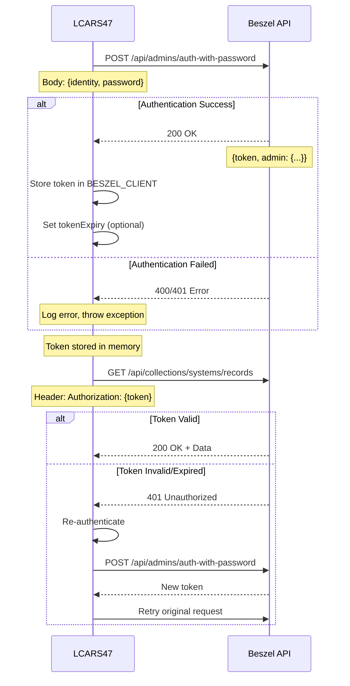

# Beszel API Integration - Technical Documentation

**Repository:** [LCARS47](https://github.com/SkyeRangerDelta/LCARS47)
**Related Issue:** [#66](https://github.com/SkyeRangerDelta/LCARS47/issues/66)
**Tech Stack:** TypeScript, Node.js >=18.20, HTTPS Module

---

## Table of Contents

1. [Beszel Overview](#beszel-overview)
2. [PocketBase Foundation](#pocketbase-foundation)
3. [Authentication Flow](#authentication-flow)
4. [API Endpoints](#api-endpoints)
5. [TypeScript Interfaces](#typescript-interfaces)
6. [Error Handling](#error-handling)
7. [Token Management](#token-management)
8. [Security Considerations](#security-considerations)
9. [Rate Limiting](#rate-limiting)

---

## Beszel Overview

### What is Beszel?

Beszel is a lightweight, self-hosted server monitoring hub that provides real-time system metrics collection and aggregation. It consists of:

- **Beszel Hub:** Central server built on PocketBase providing REST API
- **Beszel Agents:** Lightweight daemons running on monitored systems
- **Storage:** SQLite database via PocketBase

**Key Characteristics:**
- Minimal resource footprint (<50MB RAM for hub)
- RESTful JSON API
- Built-in authentication via PocketBase
- Real-time metrics collection
- No external dependencies required
- Open-source and self-hostable

**Official Resources:**
- GitHub: https://github.com/henrygd/beszel
- Documentation: https://beszel.dev

### Architecture

```
┌─────────────────┐
│  LCARS47 Bot    │
│  (TypeScript)   │
└────────┬────────┘
         │ HTTPS/REST
         │
┌────────▼────────┐
│  Beszel Hub     │
│  (PocketBase)   │
└────────┬────────┘
         │ Agent Protocol
         │
┌────────▼────────┐
│ Monitored       │
│ Servers         │
│ (Agents)        │
└─────────────────┘
```

---

## PocketBase Foundation

### Document-Based API

Beszel is built on PocketBase, which provides a document-oriented REST API similar to MongoDB:

**Core Concepts:**
- **Collections:** Groups of similar records (like MongoDB collections)
- **Records:** Individual documents with fields (like MongoDB documents)
- **Admin Users:** Authentication entities with elevated privileges
- **API Rules:** PocketBase handles authorization and validation

**Similarities to MongoDB:**
- JSON document structure
- Query filtering with operators
- Field selection and expansion
- Pagination built-in
- RESTful interface

**Key Differences:**
- SQLite backend (not document store)
- Admin/user authentication system
- More opinionated REST structure
- Built-in real-time subscriptions (not used here)

### Collections Used

**`admins`:**
- Purpose: Authentication
- Endpoint: `/api/admins/auth-with-password`
- Records: Admin user accounts

**`systems`:**
- Purpose: Server system records and metrics
- Endpoint: `/api/collections/systems/records`
- Records: Monitored server configurations and data

---

## Authentication Flow

### Overview

Beszel uses token-based authentication with PocketBase's admin authentication system. Tokens are JWT-based and typically valid for ~2 weeks.

### Authentication Diagram



### Authentication Endpoint

**POST** `/api/admins/auth-with-password`

**Request Headers:**
```
Content-Type: application/json
```

**Request Body:**
```json
{
  "identity": "admin@example.com",
  "password": "your-secure-password"
}
```

**Success Response (200 OK):**
```json
{
  "token": "eyJhbGciOiJIUzI1NiIsInR5cCI6IkpXVCJ9...",
  "admin": {
    "id": "admin_abc123xyz",
    "created": "2024-01-15 10:23:45.123Z",
    "updated": "2024-01-15 10:23:45.123Z",
    "email": "admin@example.com",
    "avatar": 0
  }
}
```

**Error Response (400 Bad Request):**
```json
{
  "code": 400,
  "message": "Failed to authenticate.",
  "data": {
    "identity": {
      "code": "validation_required",
      "message": "Missing required value."
    }
  }
}
```

**Error Response (401 Unauthorized):**
```json
{
  "code": 401,
  "message": "Invalid credentials.",
  "data": {}
}
```

### Token Storage

Tokens are stored in memory within the `LCARSClient.BESZEL_CLIENT` object:

```typescript
interface BeszelClient {
  baseUrl: string;       // "https://beszel.example.com"
  authToken: string;     // JWT token from auth response
  tokenExpiry?: number;  // Optional: Unix timestamp for expiry
}
```

**Token Lifecycle:**
1. Bot starts → `beszel_connect()` called in `ready.ts`
2. Authenticate → Store token in `LCARS47.BESZEL_CLIENT`
3. Token valid for ~2 weeks (PocketBase default)
4. Bot restarts → Re-authenticate (token not persisted)
5. 401 error → Re-authenticate and retry

---

## API Endpoints

### Base URL

All endpoints are prefixed with the Beszel instance URL:
```
https://your-beszel-instance.com
```

Configured via `BESZEL_URL` environment variable.

### List Systems

**GET** `/api/collections/systems/records`

Retrieves all registered server systems.

**Request Headers:**
```
Authorization: {token}
```

**Query Parameters:**

| Parameter | Type    | Required | Description                          | Example            |
|-----------|---------|----------|--------------------------------------|--------------------|
| page      | integer | No       | Page number (1-indexed)              | `1`                |
| perPage   | integer | No       | Records per page (max 200)           | `50`               |
| filter    | string  | No       | Filter expression                    | `status='online'`  |
| sort      | string  | No       | Sort field(s), prefix `-` for desc   | `-created`         |
| expand    | string  | No       | Relation fields to expand            | `user`             |
| fields    | string  | No       | Comma-separated fields to return     | `id,name,status`   |

**Example Request:**
```
GET /api/collections/systems/records?page=1&perPage=100
Authorization: eyJhbGciOiJIUzI1NiIsInR5cCI6IkpXVCJ9...
```

**Success Response (200 OK):**
```json
{
  "page": 1,
  "perPage": 100,
  "totalItems": 5,
  "totalPages": 1,
  "items": [
    {
      "id": "rec_abc123",
      "created": "2024-01-15 10:00:00.000Z",
      "updated": "2024-11-15 14:23:45.123Z",
      "name": "production-web-01",
      "host": "192.168.1.100",
      "port": 45876,
      "status": "online"
    },
    {
      "id": "rec_def456",
      "created": "2024-01-15 10:05:00.000Z",
      "updated": "2024-11-15 14:23:45.456Z",
      "name": "database-primary",
      "host": "192.168.1.101",
      "port": 45876,
      "status": "online"
    }
  ]
}
```

**Error Response (401 Unauthorized):**
```json
{
  "code": 401,
  "message": "The request requires valid authentication.",
  "data": {}
}
```

### Get System Details

**GET** `/api/collections/systems/records/{id}`

Retrieves detailed information and current metrics for a specific system.

**Request Headers:**
```
Authorization: {token}
```

**Path Parameters:**
- `{id}`: System record ID (e.g., `rec_abc123`)

**Query Parameters:**
Same as List Systems (filter, expand, fields not typically needed)

**Example Request:**
```
GET /api/collections/systems/records/rec_abc123
Authorization: eyJhbGciOiJIUzI1NiIsInR5cCI6IkpXVCJ9...
```

**Success Response (200 OK):**
```json
{
  "id": "rec_abc123",
  "created": "2024-01-15 10:00:00.000Z",
  "updated": "2024-11-15 14:23:45.123Z",
  "name": "production-web-01",
  "host": "192.168.1.100",
  "port": 45876,
  "status": "online",
  "info": {
    "cpu": 23.5,
    "mem": {
      "used": 13212254208,
      "total": 34359738368,
      "percent": 38.4
    },
    "disk": {
      "used": 263122862080,
      "total": 1099511627776,
      "percent": 23.9
    },
    "net": {
      "down": 2097152,
      "up": 838860
    },
    "uptime": 3931454,
    "temp": 52
  }
}
```

**Field Descriptions:**

| Field           | Type   | Description                                  |
|-----------------|--------|----------------------------------------------|
| cpu             | number | CPU usage percentage (0-100)                 |
| mem.used        | number | Memory used in bytes                         |
| mem.total       | number | Total memory in bytes                        |
| mem.percent     | number | Memory usage percentage                      |
| disk.used       | number | Disk used in bytes                           |
| disk.total      | number | Total disk in bytes                          |
| disk.percent    | number | Disk usage percentage                        |
| net.down        | number | Download bytes per second                    |
| net.up          | number | Upload bytes per second                      |
| uptime          | number | System uptime in seconds                     |
| temp            | number | CPU/system temperature in Celsius (optional) |

**Error Response (404 Not Found):**
```json
{
  "code": 404,
  "message": "The requested resource wasn't found.",
  "data": {}
}
```

---

## TypeScript Interfaces

### Core Interfaces

```typescript
// Client configuration and authentication
export interface BeszelClient {
  baseUrl: string;
  authToken: string;
  tokenExpiry?: number;
}

// Authentication response
export interface BeszelAuthResponse {
  token: string;
  admin: {
    id: string;
    email: string;
    created?: string;
    updated?: string;
    avatar?: number;
  };
}

// System record (basic info)
export interface BeszelSystemRecord {
  id: string;
  name: string;
  status: string;
  host: string;
  port: number;
  created: string;
  updated: string;
}

// System record with metrics
export interface BeszelSystemDetails extends BeszelSystemRecord {
  info: BeszelSystemMetrics;
}

// Paginated list response
export interface BeszelListResponse<T> {
  page: number;
  perPage: number;
  totalItems: number;
  totalPages: number;
  items: T[];
}

// System metrics
export interface BeszelSystemMetrics {
  cpu: number;
  mem: {
    used: number;
    total: number;
    percent: number;
  };
  disk: {
    used: number;
    total: number;
    percent: number;
  };
  net: {
    down: number;
    up: number;
  };
  uptime: number;
  temp?: number;
}
```

### Usage Examples

```typescript
// Type-safe authentication
const authResponse: BeszelAuthResponse = await authenticate();
const token: string = authResponse.token;

// Type-safe system list
const systemsResponse: BeszelListResponse<BeszelSystemRecord> =
  await getSystems(client);
const systems: BeszelSystemRecord[] = systemsResponse.items;

// Type-safe metrics
const systemDetails: BeszelSystemDetails =
  await getSystemMetrics(client, systemId);
const cpuUsage: number = systemDetails.info.cpu;
const memoryPercent: number = systemDetails.info.mem.percent;
```

---

## Error Handling

### Error Categories

**1. Authentication Errors (401)**
- Invalid credentials
- Expired token
- Missing Authorization header

**Action:** Re-authenticate and retry

**2. Not Found Errors (404)**
- System ID doesn't exist
- Collection not found
- Invalid endpoint

**Action:** Log error, inform user

**3. Network Errors**
- Connection timeout
- DNS resolution failure
- SSL/TLS errors

**Action:** Log error, return user-friendly message

**4. Server Errors (500)**
- Beszel instance crash
- Database errors
- Internal PocketBase errors

**Action:** Log error, retry with exponential backoff

### Error Handling Pattern

```typescript
async function makeRequest(
  client: BeszelClient,
  path: string,
  retryAuth: boolean = true
): Promise<any> {
  try {
    const response = await httpsRequest(client, path);

    if (response.statusCode === 401 && retryAuth) {
      // Re-authenticate
      Utility.log('warn', '[Beszel] Token expired, re-authenticating...');
      const newClient = await beszel_connect();

      // Update global client
      LCARS47.BESZEL_CLIENT = newClient;

      // Retry with new token (prevent infinite loop)
      return await makeRequest(newClient, path, false);
    }

    if (response.statusCode !== 200) {
      throw new Error(`HTTP ${response.statusCode}: ${response.message}`);
    }

    return response.data;

  } catch (error) {
    Utility.log('err', `[Beszel] Request failed: ${error.message}`);
    throw error;
  }
}
```

### Timeout Handling

```typescript
const requestWithTimeout = (
  options: https.RequestOptions,
  timeout: number = 5000
): Promise<Response> => {
  return new Promise((resolve, reject) => {
    const req = https.request(options, resolve);

    // Set timeout
    req.setTimeout(timeout, () => {
      req.destroy();
      reject(new Error('Request timeout'));
    });

    req.on('error', reject);
    req.end();
  });
};
```

---

## Token Management

### Token Lifecycle

**Generation:**
- Created via `/api/admins/auth-with-password`
- JWT format signed by PocketBase
- Contains admin ID and expiry

**Storage:**
- In-memory only (not persisted to disk)
- Stored in `LCARSClient.BESZEL_CLIENT.authToken`
- Lost on bot restart

**Expiry:**
- Default: ~2 weeks (PocketBase configuration)
- Can be customized in Beszel instance
- Not explicitly checked by bot (relies on 401 errors)

**Refresh:**
- No refresh token mechanism
- Re-authenticate when 401 received
- New token replaces old token

### Token Expiry Tracking (Optional)

```typescript
interface BeszelClient {
  baseUrl: string;
  authToken: string;
  tokenExpiry?: number;  // Unix timestamp
}

// Set expiry during authentication
const client: BeszelClient = {
  baseUrl: process.env.BESZEL_URL,
  authToken: authResponse.token,
  tokenExpiry: Date.now() + (14 * 24 * 60 * 60 * 1000)  // 2 weeks
};

// Check before request
function isTokenExpired(client: BeszelClient): boolean {
  if (!client.tokenExpiry) return false;
  return Date.now() >= client.tokenExpiry;
}

// Proactive refresh
if (isTokenExpired(LCARS47.BESZEL_CLIENT)) {
  LCARS47.BESZEL_CLIENT = await beszel_connect();
}
```

### Best Practices

1. **Always handle 401 errors** with re-authentication
2. **Don't persist tokens** to disk (security risk)
3. **Log authentication events** for debugging
4. **Use singleton pattern** for client (one token per bot instance)
5. **Clear token on bot shutdown** (optional cleanup)

---

## Security Considerations

### Credential Management

**Environment Variables:**
```bash
BESZEL_URL=https://beszel.example.com
BESZEL_EMAIL=admin@example.com
BESZEL_PASSWORD=your-secure-password
```

**Security Checklist:**
- ✅ Store credentials in `.env` file
- ✅ Ensure `.env` is in `.gitignore`
- ✅ Never commit credentials to version control
- ✅ Use strong passwords (16+ characters)
- ✅ Rotate passwords periodically
- ✅ Use dedicated admin account for bot
- ❌ Never log passwords or tokens
- ❌ Never expose credentials in error messages

### Network Security

**HTTPS Enforcement:**
```typescript
// Validate HTTPS in production
if (process.env.NODE_ENV === 'production') {
  if (!process.env.BESZEL_URL.startsWith('https://')) {
    throw new Error('BESZEL_URL must use HTTPS in production');
  }
}
```

**Certificate Validation:**
- Node.js HTTPS module validates certificates by default
- Reject self-signed certificates in production
- Use Let's Encrypt or valid CA certificates

**Network Segmentation:**
- Deploy Beszel on private network if possible
- Use firewall rules to restrict access
- Consider VPN or SSH tunnel for extra security

### Token Security

**Storage:**
- In-memory only (never disk)
- Not logged or printed
- Cleared on process exit

**Transmission:**
- HTTPS encrypts token in transit
- Never send token in URL parameters
- Always use Authorization header

**Access Control:**
- Limit Discord command usage with permissions
- Review who can execute `/server-status`
- Consider role-based restrictions

### Data Privacy

**Metrics Exposure:**
- Server metrics visible to command users
- Consider sensitive information in system names
- Use Discord's command permissions for access control

**Logging:**
- Log API calls but not request bodies
- Sanitize logs before sharing
- Avoid logging authentication responses

---

## Rate Limiting

### PocketBase Limits

PocketBase (and thus Beszel) does not enforce strict rate limits by default, but consider:

**Recommended Limits:**
- Max 100 requests/minute per client
- Implement client-side throttling
- Use pagination for large datasets

**Bot Implementation:**
```typescript
// Simple rate limiter
class RateLimiter {
  private requests: number[] = [];
  private maxRequests: number;
  private windowMs: number;

  constructor(maxRequests: number = 60, windowMs: number = 60000) {
    this.maxRequests = maxRequests;
    this.windowMs = windowMs;
  }

  async checkLimit(): Promise<boolean> {
    const now = Date.now();
    this.requests = this.requests.filter(t => now - t < this.windowMs);

    if (this.requests.length >= this.maxRequests) {
      return false;  // Rate limited
    }

    this.requests.push(now);
    return true;  // Allowed
  }
}

const beszelLimiter = new RateLimiter(60, 60000);  // 60 req/min

// Use before API calls
if (!await beszelLimiter.checkLimit()) {
  throw new Error('Rate limit exceeded, please wait');
}
```

### Best Practices

1. **Cache autocomplete results** for 30-60 seconds
2. **Implement exponential backoff** for retries
3. **Use pagination** when fetching large system lists
4. **Avoid polling** (use on-demand requests only)
5. **Monitor API usage** via logs

---

## Example Implementation

### Complete Authentication Flow

```typescript
import https from 'https';
import Utility from '../Utilities/SysUtils.js';

interface BeszelClient {
  baseUrl: string;
  authToken: string;
  tokenExpiry?: number;
}

interface BeszelAuthResponse {
  token: string;
  admin: {
    id: string;
    email: string;
  };
}

async function beszel_connect(): Promise<BeszelClient> {
  Utility.log('info', '[Beszel] Authenticating with Beszel API...');

  const baseUrl = process.env.BESZEL_URL;
  const email = process.env.BESZEL_EMAIL;
  const password = process.env.BESZEL_PASSWORD;

  if (!baseUrl || !email || !password) {
    throw new Error('Beszel credentials missing from environment');
  }

  const authBody = JSON.stringify({
    identity: email,
    password: password
  });

  const url = new URL('/api/admins/auth-with-password', baseUrl);

  const options: https.RequestOptions = {
    hostname: url.hostname,
    port: url.port || 443,
    path: url.pathname,
    method: 'POST',
    headers: {
      'Content-Type': 'application/json',
      'Content-Length': Buffer.byteLength(authBody)
    }
  };

  return new Promise((resolve, reject) => {
    const req = https.request(options, (res) => {
      const chunks: Buffer[] = [];

      res.on('data', (chunk: Buffer) => {
        chunks.push(chunk);
      });

      res.on('end', () => {
        const responseBody = Buffer.concat(chunks).toString();

        if (res.statusCode !== 200) {
          Utility.log('err', `[Beszel] Auth failed: ${responseBody}`);
          return reject(new Error(`Authentication failed: ${res.statusCode}`));
        }

        const authResponse: BeszelAuthResponse = JSON.parse(responseBody);
        Utility.log('info', '[Beszel] Authentication successful');

        resolve({
          baseUrl: baseUrl,
          authToken: authResponse.token,
          tokenExpiry: Date.now() + (14 * 24 * 60 * 60 * 1000)
        });
      });

      res.on('error', (err) => {
        Utility.log('err', `[Beszel] Response error: ${err.message}`);
        reject(err);
      });
    });

    req.on('error', (err) => {
      Utility.log('err', `[Beszel] Request error: ${err.message}`);
      reject(err);
    });

    req.write(authBody);
    req.end();
  });
}
```

---

## Related Documentation

- [Feature Documentation](../features/beszel-integration.md)
- [Implementation Guide](../implementation/server-status-command.md)
- [Command Architecture](../architecture/command-pattern.md)

---

**Document Version:** 1.0
**Last Updated:** 2025-11-15
**API Version:** Beszel v0.x (PocketBase-based)
**Maintained By:** LCARS47 Development Team
